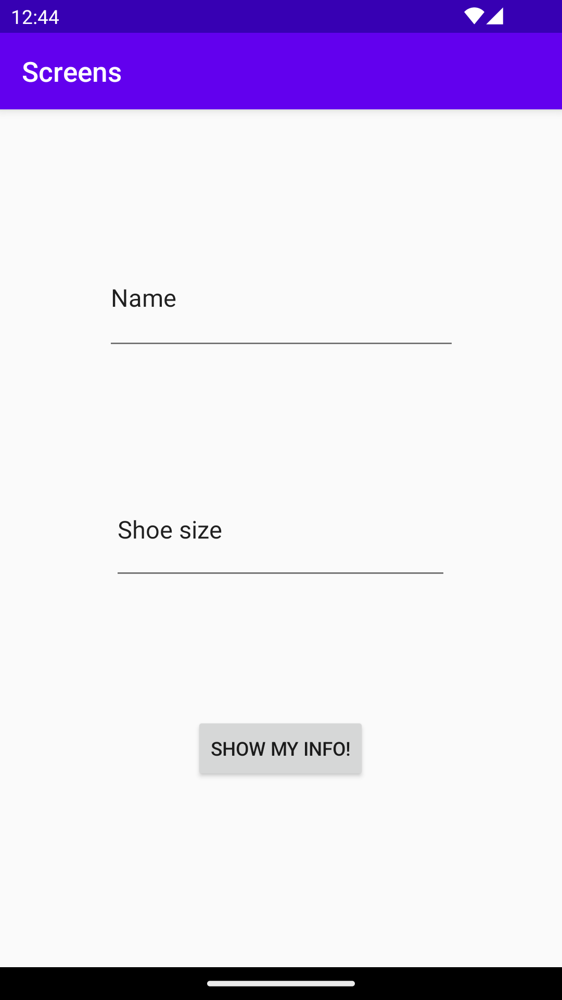
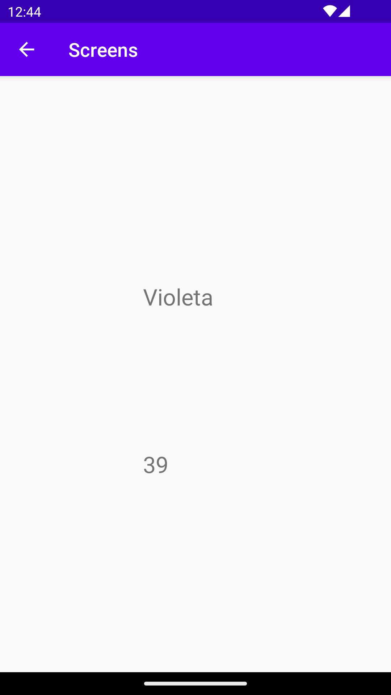

# Rapport

I created the layout for main screen with 2 textViews for user inputs and a button
to show the result. I changed the size, name and added constraints.
```
 <EditText
        android:id="@+id/editTextName"
        android:layout_width="257dp"
        android:layout_height="83dp"
        android:layout_marginBottom="88dp"
        android:ems="10"
        android:inputType="textPersonName"
        android:text="Name"
        app:layout_constraintBottom_toTopOf="@+id/editTextShoeSize"
        app:layout_constraintEnd_toEndOf="parent"
        app:layout_constraintStart_toStartOf="parent"
        app:layout_constraintTop_toTopOf="parent"
        app:layout_constraintVertical_bias="1.0" />

    <EditText
        android:id="@+id/editTextShoeSize"
        android:layout_width="246dp"
        android:layout_height="80dp"
        android:layout_marginBottom="96dp"
        android:ems="10"
        android:inputType="text"
        android:text="Shoe size"
        app:layout_constraintBottom_toTopOf="@+id/showButton"
        app:layout_constraintEnd_toEndOf="parent"
        app:layout_constraintHorizontal_bias="0.497"
        app:layout_constraintStart_toStartOf="parent" />

    <Button
        android:id="@+id/showButton"
        android:layout_width="wrap_content"
        android:layout_height="wrap_content"
        android:layout_marginBottom="136dp"
        android:text="Show my info!"
        app:layout_constraintBottom_toBottomOf="parent"
        app:layout_constraintEnd_toEndOf="parent"
        app:layout_constraintHorizontal_bias="0.498"
        app:layout_constraintStart_toStartOf="parent" />
```

I created a second activity called ShowActivity to be able to output inserted data
and added two textViews for the inserted data be able to show on the screen.

```
  <TextView
        android:id="@+id/textViewName"
        android:layout_width="111dp"
        android:layout_height="90dp"
        android:layout_marginTop="216dp"
        android:text="Name"
        android:textSize="24sp"
        app:layout_constraintEnd_toEndOf="parent"
        app:layout_constraintStart_toStartOf="parent"
        app:layout_constraintTop_toTopOf="parent"
        tools:ignore="UnknownId" />

    <TextView
        android:id="@+id/textViewShoeSize"
        android:layout_width="111dp"
        android:layout_height="87dp"
        android:text="ShoeSize"
        android:textSize="24sp"
        app:layout_constraintBottom_toBottomOf="parent"
        app:layout_constraintEnd_toEndOf="parent"
        app:layout_constraintStart_toStartOf="parent"
        app:layout_constraintTop_toBottomOf="@+id/textViewName"
        app:layout_constraintVertical_bias="0.368" />
```

I added Button object in MainActivity.java file and created variables for the data input.
I added action listener for the button and onClick method to show the showActivity screen 
when button is pushed. Intent variable is used to start the activity.
Inputs are converted to Strings to adjust the datatypes.

```
Button showButton = findViewById(R.id.showButton);
        showButton.setOnClickListener(new View.OnClickListener() {
            public void onClick(View view) {

                EditText nameEdit = findViewById(R.id.editTextName);
                String name = nameEdit.getText().toString();

                EditText shoeSizeEdit = findViewById(R.id.editTextShoeSize);
                String shoeSize = shoeSizeEdit.getText().toString();

                Intent intent = new Intent(MainActivity.this, ShowActivity.class);
                intent.putExtra("name", name); // Optional
                intent.putExtra("shoeSize", shoeSize ); // Optional
                startActivity(intent);
            }
        });
```

I used Bundle in ShowActivity.java file to handle the intent. 
I added TextView for name and for the shoe size to be found by Id. 

```
Bundle extras = getIntent().getExtras();
        if (extras != null) {

            String name = extras.getString("name");
            String number = extras.getString("shoeSize");

            TextView nameView = findViewById(R.id.textViewName);
            nameView.setText(name);

            TextView shoeSizeView = findViewById(R.id.textViewShoeSize);
            shoeSizeView.setText(number);
        }
```

I added "go back to main" button on the top left corner by adding this line in AndroidManifest.xml file.

```
 android:parentActivityName=".MainActivity"
```

These are the pictures of my App.




